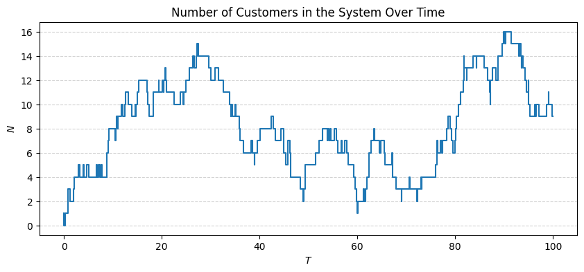

# Discrete Event Simulation: Simple Queueing Systems



Authored by:
- [@DKLEINLEUNK](https://github.com/DKLEINLEUNK)
- [@HollydP](https://github.com/HollydP)
- [@Ninavd](https://github.com/Ninavd)

## Table of Content

* [Introduction](#introduction)
* [Project Structure](#project-structure)
* [Installation](#installation)
* [Instructions CLI](#instructions-command-line-interface)

## Introduction

This repository contains code and notebooks we used for Assignment 2, covering a discrete event simulation of a simple queueing system implemented using `SimPy`. In the `notebooks/` folder, all relevant plots can be found. 

Simulation data was generated from the command-line (excluding some parts of the notebook) for which bash scripts can be found in . 

## Project Structure

```
.
├── bash_scripts/           # DATA GENERATION
│   └── ...
│
├── data/                   # DATASETS
│   ├── iterations_rho_required.csv
│   └── simulation_averages/
│       └── ...
│
├── notebooks/              # PLOTS
│   ├── comparisons_queueing_systems.ipynb
│   └── statistical_evaluation.ipynb
│   
├── helpers.py              # Helper functions
├── main.py                 # Handles CLI use (see below)
├── Metrics.py              # Class handling system metrics
├── Queue.py                # Class handling queueing system
│
├── LICENSE
├── README.md
└── requirements.txt
```

## Installation

1. Clone the repository:
```bash
git clone https://github.com/DKLEINLEUNK/DES-simple-queues
```
2. Change directory to the cloned repository.
3. Install the required dependencies:
```bash
pip install -r requirements.txt
```

## Instructions Command-Line Interface

Simulations may be run using the command-line using `python3 main.py [args]`. The following arguments may be specified:

```bash
python3 main.py queue_system run_time [-h] [-c CUSTOMERS] [-l ARRIVAL_RATE] [-m SERVICE_RATE] [-d DISCIPLINE] [-n N] [--save] [--save_raw]
```

```
Simulate queueing systems and measure performance

positional arguments:
  queue_system          Queueing system to use in kendall notation, f.e. MM1
  run_time              max run_time used per simulation

options:
  -h, --help            show this help message and exit
  -c CUSTOMERS, --customers CUSTOMERS
                        max customers arriving in one simulation
  -l ARRIVAL_RATE, --arrival_rate ARRIVAL_RATE
                        mean arrival rate (lambda)
  -m SERVICE_RATE, --service_rate SERVICE_RATE
                        mean service rate (mu)
  -d DISCIPLINE, --discipline DISCIPLINE
                        how to select from queue (FIFO or SJF)
  -n N                  number of simulations
  --save                store average results in csv
  --save_raw            store all data in csv for each simulation
```
